# Database schema

Source of truth: `packages/database/prisma/schema.prisma` (PostgreSQL via Prisma 7).

## Design rules

- Internal PKs are cuid strings; **public IDs** (`publicId`) are unique, prefixed, and safe to expose.
- Tenant-owned rows carry `organizationId` (or are reachable only through a tenant-owned parent).
- Soft delete where retention matters (`User.deletedAt`, `Organization.deletedAt`, `Department.deletedAt`).
- Audit events are append-oriented; organization FK uses `onDelete: SetNull` so history can outlive a hard delete path.
- Integration secrets are encrypted columns (`ciphertext`, `iv`, `authTag`), not plaintext.

## Principal entities

### Identity

| Model | Notes |
| --- | --- |
| `User` | Better Auth compatible; `publicId`, `platformRole`, `activeOrganizationId`, `mfaEnabled` |
| `Session` | Auth sessions; optional `activeOrganizationId` |
| `Account` | OAuth/provider links (`providerId` + `accountId` unique) |
| `Verification` | Magic-link / verification tokens |
| `RobloxIdentity` | One Roblox link per user (`robloxUserId` unique) |
| `DiscordIdentity` | One Discord link per user (`discordUserId` unique) |

### Tenancy

| Model | Notes |
| --- | --- |
| `Organization` | Tenant root: slug, type, size, modules, plan, status, soft delete |
| `OrganizationDomain` | Custom domains (schema ready; verification flow planned) |
| `Membership` | User↔org; unique `(organizationId, userId)`; optional rank |
| `Invitation` | Email invite with hashed token; 7-day expiry on create |

### Access control

| Model | Notes |
| --- | --- |
| `Role` | Per-org roles; system roles keyed `owner`/`admin`/`moderator`/`staff`/`member` |
| `MembershipRole` | M2M membership↔role |
| `Rank` | Ordered staff ranks; optional Discord role id |
| `Department` / `DepartmentMember` | Org departments and memberships |
| `PermissionGrant` / `PermissionDenial` | Per-membership overrides |
| `BreakGlassSession` | Time-boxed elevated access |

### Audit, integrations, ops

| Model | Notes |
| --- | --- |
| `AuditEvent` | Action, resource, actor, source, sanitized metadata/before/after |
| `IntegrationCredential` | Encrypted provider secrets; unique `(organizationId, provider)` |
| `SupportAccessSession` | Planned support impersonation windows |
| `NotificationPreference` | Per user/org/channel prefs |
| `JobFailure` | Worker failure bookkeeping |

## Tenant ownership

Everything operational hangs off `Organization`:

- Memberships, invitations, roles, ranks, departments
- Audit events (nullable org for platform-level events)
- Integration credentials, domains, support sessions, notification prefs

Users are global; tenancy is enforced through membership + `authorize()` resource checks — not separate databases per tenant.

## Important indexes

| Table | Index / constraint |
| --- | --- |
| `organizations` | unique `slug`, `publicId`; index `status` |
| `memberships` | unique `(organizationId, userId)`; `(organizationId, status)`; `userId` |
| `invitations` | unique `tokenHash`; `(organizationId, email)`; `(organizationId, status)` |
| `roles` | unique `(organizationId, key)` |
| `ranks` | unique `(organizationId, name)`, `(organizationId, order)` |
| `departments` | unique `(organizationId, slug)`; `(organizationId, isActive)` |
| `permission_grants` / `_denials` | `(membershipId, action)` |
| `audit_events` | `(organizationId, createdAt)`; `(organizationId, resourceType, resourceId)`; `(actorUserId, createdAt)` |
| `integration_credentials` | unique `(organizationId, provider)` |
| `sessions` / `accounts` | `userId` |
| `job_failures` | `(queue, createdAt)` |

## Deletion semantics

| Resource | Behavior |
| --- | --- |
| Organization | Soft delete via `deletedAt` + status (`PENDING_DELETION` / `DELETED`); listings exclude deleted |
| Membership | Status → `FORMER` / `leftAt` preferred over hard delete for history |
| Cascade FKs | Child rows cascade when parent org/membership is hard-deleted |
| Audit | `organizationId` / `actorUserId` set null on parent delete — events retained |
| Invitations | Status transitions (`REVOKED`, `EXPIRED`, `ACCEPTED`); token never stored plaintext |
| Credentials | Cascade with organization; ciphertext only |

Hard-delete retention jobs are not implemented in R0/R1.

## Entity relationship (mermaid)

```mermaid
erDiagram
  User ||--o{ Session : has
  User ||--o{ Account : has
  User ||--o{ Membership : joins
  User ||--o| RobloxIdentity : links
  User ||--o| DiscordIdentity : links
  User ||--o{ Invitation : invites
  User ||--o{ AuditEvent : acts
  User ||--o{ SupportAccessSession : support

  Organization ||--o{ Membership : has
  Organization ||--o{ Invitation : has
  Organization ||--o{ Role : defines
  Organization ||--o{ Rank : defines
  Organization ||--o{ Department : has
  Organization ||--o{ AuditEvent : scopes
  Organization ||--o{ IntegrationCredential : stores
  Organization ||--o{ OrganizationDomain : hosts
  Organization ||--o{ SupportAccessSession : grants
  Organization ||--o{ NotificationPreference : prefs

  Membership ||--o{ MembershipRole : assigned
  Role ||--o{ MembershipRole : includes
  Membership }o--o| Rank : holds
  Membership ||--o{ DepartmentMember : in
  Department ||--o{ DepartmentMember : has
  Membership ||--o{ PermissionGrant : grants
  Membership ||--o{ PermissionDenial : denies
  Membership ||--o{ BreakGlassSession : elevates
```

